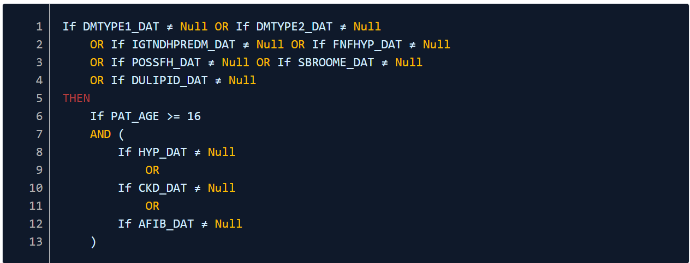

#  CVD Cohort Definitions

## Overview
CVD prevent data contains information for CVD risk group patients. These patients are assigned to multiple cohorts, denoted by a cohort code in the cohort field. This page is to document the cohort assignment, assumptions and definitions.

- [CVD Cohort Definitions](#cvd-cohort-definitions)
  - [Overview](#overview)
  - [Cohort Summary](#cohort-summary)
    - [Cohort 01: Patients at high risk for CVD](#cohort-01-patients-at-high-risk-for-cvd)
    - [Cohort Description](#cohort-description)
    - [Inclusion Refsets](#inclusion-refsets)
  - [Cohort 02: Patients with a CVD diagnosis](#cohort-02-patients-with-a-cvd-diagnosis)
    - [Cohort Description](#cohort-description-1)
    - [Inclusion Refsets](#inclusion-refsets-1)
  - [Cohort 03: Patients potenitally at high risk for CVD](#cohort-03-patients-potenitally-at-high-risk-for-cvd)

## Cohort Summary

### Cohort 01: Patients at high risk for CVD

**Current Scope: In-scope**

**Cohort Code:** CVDPCX001

### Cohort Description

Patients registered in a GP practice that have been diagnosed with at least one of the six high risk conditions (hypertension, familial hypercholesterolaemia and other hyperlipidaemias, chronic kidney disease (grades 3 to 5), non-diabetic hyperglycaemia, type 1 or 2 diabetes mellitus or atrial fibrillation) up to and including the end of the reporting period who have not dissented to their data being used for national audit or collections.

These are the steps in defining this cohort:

1. Reject patients from the specified population who dissent/object from the use of their GP patient identifiable data within national audit and who have not subsequently consented, up to and including the reporting period end date. Pass all remaining patients to the next rule.
2. Reject patients passed to this rule with existing CVD as defined as having at least one of the conditions below:
     - Stroke or transient ischaemic attack
     - Coronary heart disease (including myocardial infarction and acute coronary syndrome)
     - Heart failure
     - Abdominal aortic aneurysm
     - Peripheral arterial disease

Pass all remaining patients to the next rule.

1. Select patients passed to this rule who have at least one or more of the following criteria:
  - a diagnosis of diabetes mellitus (type 1 and type 2)
  - a diagnosis of non-diabetic hyperglycaemia or glucose intolerance or pre-diabetes
  - a diagnosis of familial hypercholesterolaemia or other hyperlipidaemias, including possible and probable diagnosis and those patients with a Simon Broome or Dutch lipid score in their record.

Pass all remaining patients to the next rule.

1. Select patients passed to this rule who are aged 16 or over and have at least one of the following criteria:
  - a diagnosis of hypertension
  - a diagnosis of chronic kidney disease (grades 3 to 5)
  - a diagnosis of atrial fibrillation (including atrial flutter)

Reject the remaining patients.

### Inclusion Refsets

## Cohort 02: Patients with a CVD diagnosis

**Current Scope: In-scope**

**Cohort Code:** CVDPCX002

### Cohort Description

Patients registered in a GP practice with cardiovascular disease diagnosed up to and including the end of the reporting period, who have not dissented to their data being used for national audit or collections.

These are the steps in defining this cohort:

1. Reject patients from the specified population who dissent/object from the use of their GP patient identifiable data within national audit and who have not subsequently consented, up to and including the reporting period end date. Pass all remaining patients to the next rule.
2. Select patients passed to this rule with existing CVD as defined as having at least one of the conditions below:
  - Stroke or transient ischaemic attack
  - Coronary heart disease (including myocardial infarction and acute coronary syndrome)
  - Heart failure
  - Abdominal aortic aneurysm
  - Peripheral arterial disease
3. Reject the remaining patients

### Inclusion Refsets

## Cohort 03: Patients potenitally at high risk for CVD

**Current Scope: Out-of-scope**

**Cohort Code:** CVDPCX003

Cohort Description

Patients registered in a GP practice without a coded diagnosis of any of the 6 high-risk conditions (hypertension, familial hypercholesterolaemia and other hyperlipidaemias, chronic kidney disease (grades 3 to 5), non-diabetic hyperglycaemia, type 1 or 2 diabetes mellitus or atrial fibrillation) or existing CVD, and who have entries in their record that suggest they may have an undiagnosed high-risk condition, up to and including the reporting period end date, who have not dissented to their data being used for national audit or collections.
