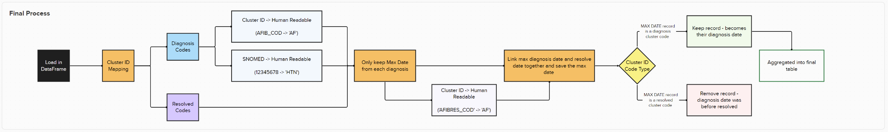

# CVDP Diagnostic Flags

# Outline

- [CVDP Diagnostic Flags](#cvdp-diagnostic-flags)
- [Outline](#outline)
  - [Overview](#overview)
  - [Process Flow](#process-flow)
  - [Methodology](#methodology)

## Overview

- The CVDP Diagnostic Flags Stage takes in our Journal Table defined in [Extract Processing](./extract_processing.md) and picks out the latest  **non-resolved** diagnosis date for each of our specified cardiovasular diseases. For each of these a  columns is created in the final patient table.

## Process Flow

## Methodology

- Map all Diagnostic Codes ('AFIB\_COD', 'STROKE\_COD', etc...) to a new column 'diagnosis' ('AF', 'STROKE', etc...)
  - This step is performed for all SNOMED Codes and Cluster\_IDs
  - Resolved codes stay as they are (AFIBRES\_COD → AFIBRES\_COD)
- Keep Latest diagnosis date for each 'diagnosis'
- Map all 'diagnosis' to 'parent'
  - Diagnosis Codes stay as they are ('AF' → 'AF')
  - Resolved Codes take on their diagnosis counterpart ('AFIBRES\_COD' → 'AF')
- For each 'parent' column, get the max (latest) date which is the most recent event for that disease
- With this max date, filter anything out that occured earlier.
- If the record is a resolved date, remove - the diagnosis has been resolved
- If the record is a diagnosis - keep
- Because of the way we are pivoting the table at the end to create columns, we ensure that all the CVDP Diagnosis Columns are created from the params list, if the column does not exist - fill with nulls

## Assumptions and Limitations

- We assume that all dates, SNOMED codes and cluster\_id's are inputted correctly
- For Cluster ID and SNOMED Lookup, we follow the SQL Code given to us by NHS England
- For our final table, we only look at a certain subset of diseases specified within the [scope](./scope.md)
- We assume that the final date for a disease has to be the last thing that occurred, if for some reason this was not the case our logic would completely break
- If a diagnosis and resolution occur on the same day, we assume this is in error and we keep the diagnosis only.
