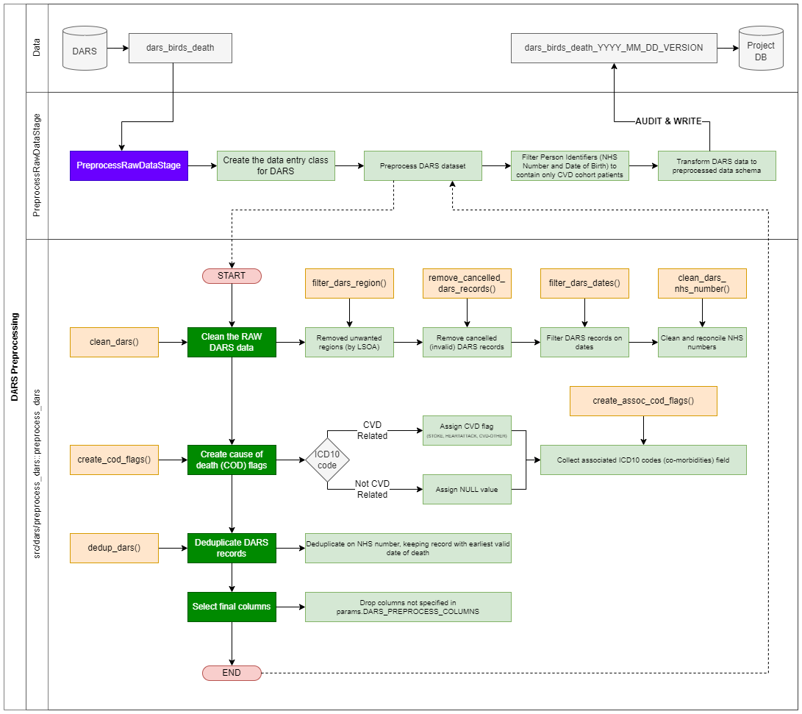

# DARS Deaths

## Overview

This page details the pre-processing required for the death's dataset (Civil Registrations of Deaths - DARS).

- [DARS Deaths](#dars-deaths)
  - [Overview](#overview)
  - [Summary of Functionality](#summary-of-functionality)
- [Methodology](#methodology)
  - [Process Flow of DARS Preprocessing](#process-flow-of-dars-preprocessing)
  - [Method Overview](#method-overview)
  - [DARS NHS Numbers](#dars-nhs-numbers)
- [Data Specification](#data-specification)
- [Assumptions and Limitations](#assumptions-and-limitations)
  - [Assumptions](#assumptions)
  - [Limitations](#limitations)

## Summary of Functionality

- DARS is processed in the PreprocessRawDataStage for use in the creation of the events table and integration into the patient table
- The pre-processing is responsible for:
  - Filtering the patients to keep only those that are specified from CVDP extracts (the table output of CreatePatientCohortTableStage)
  - Cleaning of the DARS data (NHS number cleaning and reconilliation, removal of invalid death records)
  - Deduplication of DARS records to keep the earliest valid death record
- The pre-processing code is contained in the [preprocess\_dars](../src/dars/preprocess_dars.py) notebook.

# Methodology

A code flow is provided (below) that details the overall process of extracting, transforming, and saving the DARS data asset. Below is a more detailed overview of each preprocessing stage and the methodology involved.

## Process Flow of DARS Preprocessing

## Method Overview

1. Data: Loaded from the DARS.dars\_birds\_death table
2. Stage: DARS data is loaded by the [PreprocessRawDataStage](pipeline_stages.md#preprocess-raw-data-stage) and a data entry class (responsible for providing the pre-processing function and the column mappings, alongside indicating any cleaning or validation functions).
3. Stage: The DARS dataset is filtered on NHS number and Date of Birth to retain records that match patients from the eligible cohort table (produced in the CreatePatientCohortTableStage).
4. Stage: The DARS data is then processed using the pre-processing function (defined in [src/dars/preprocess\_dars](../src/dars/preprocess_dars.py)).
     1. Src: The DARS data is cleaned, removing unwanted (non-England) LSOAs, removing any DARS records that have been indicated as cancelled or invalid, and the NHS numbers are cleaned and reconciled.
     2. Src: The cause of death (COD) flags is created from the primary cause of death clinical code (ICD10 code). COD flags are either CVD related (STROKE, HEARTATTACK or CVD-OTHER) or null (non-CVD related primary death code).
     3. Src: The DARS data is then deduplicated on patient identifiable information (NHS number and date of birth), keeping the earliest death record and removing the others
     4. Src: The DARS data is reduced to required columns only (specified in params.DARS\_PREPROCESS\_COLUMNS)
5. Stage: The processed DARS data is then transformed (mapped using the column mappings providing in the data entry class) to the standard pre-processed data asset schema.
6. Stage: Finally, the DARS data is passed from the PreprocessRawDataStage to the Audit and Write stages (add\_auditing\_field\_stage and write\_asset\_stage respectively) and saved to the params-defined database with the naming convention dars\_bird\_deaths\_YYYY\_MM\_DD\_VERSION, where VERSION is the hash from the main pipeline run.

## DARS NHS Numbers

Part of the DARS data cleaning involves the NHS numbers present in DARS. There are two main NHS number fields in DARS: DEC\_CONF\_NHS\_NUMBER and DEC\_NHS\_NUMBER.
DEC\_CONF\_NHS\_NUMBER is the field containing the confirmed NHS number - this field is kept if it is not null. DEC\_NHS\_NUMBER is selected only if DEC\_CONF\_NHS\_NUMBER is not available. If neither of these NHS fields are populated (both are null) then the record is filtered out.

# Data Specification

The data specification defines the descriptions, mapping and relationship of:

- Raw DARS data asset
- Processed DARS data asset
- Field mapping and descriptions

Where multiple fields are specified, these represent a coalesce/processing (one-to-many or many-to-one).
 Fields that are not present in the raw data (added or calculated fields) will have no corresponding raw data mapping values.

| **Raw Data** | |**Processed Data** | ||
| --- | --- |---|---|---|
| **Field Name(s)** | **Description** | **Field Name(s)** | **Description** | **Field Type** |
| DEC\_CONF\_NHS\_NUMBER DEC\_NHS\_NUMBER | Confirmed NHS number Potential NHS number | person\_id | Reconcilled NHS number from DARS records | str |
| DEC\_DATE\_OF\_BIRTH | Date of patient's birth | birth\_date | Patient date of birth | date |
| DARS\_BIRD\_DEATHS\_ID | Unique identifier of the DARS record | record\_id | Unique identifier of DARS record | int |
| DEC\_SEX | Sex code of patient | sex | Sex code of patient | str |
| REG\_DATE\_OF\_DEATH | Date of patient's death | death\_date | Patient date of death | date |
| S\_UNDERLYING\_COD\_ICD10 | ICD10 code for primary cause of death | flag | Mapped string from code field (Human readable - ICD10 description) | str |
| S\_UNDERLYING\_COD\_ICD10 | ICD10 code for primary cause of death | code | String from code field (ICD10 code) | str |
| DARS\_COMORBS\_CODES\_FIELD | ICD10 codes for associated causes of death | code\_array | ICD10 codes associated (not primary cause of death) with DARS record | str |
| LSOAR | LSOA code of patient's recorded residence at death | lsoa\_residence | LSOA code of patient's recorded residence at death | str |
| LSOA11\_POD | LSOA code of location of patient's death | lsoa\_death\_location | LSOA code of location of patient's death | str |
| DARS\_COMORBS\_CODES\_FIELD | ICD10 codes for associated causes of death | flag\_assoc\_cvd-other | Boolean flag:  1 = associated cause of death ICD10 codes contain ICD10 codes for CVD OTHER death category    0 = no CVD OTHER ICD10 codes present | int |
| DARS\_COMORBS\_CODES\_FIELD | ICD10 codes for associated causes of death | flag\_assoc\_stroke | Boolean flag:  1 = associated cause of death ICD10 codes contain ICD10 codes for STROKE death category   0 = no STROKE ICD10 codes present | int |
| DARS\_COMORBS\_CODES\_FIELD | ICD10 codes for associated causes of death | flag\_assoc\_heartattack | Boolean flag: 1 = associated cause of death ICD10 codes contain ICD10 codes for HEARTATTACK death category  0 = no HEARTATTACK ICD10 codes present | int |
| | | dataset | Literal column containing the name of the originating database (dars\_birds\_deaths) | str |
| | | META | Audit META column containing pipeline run information | struct |

# Assumptions and Limitations

## Assumptions

- All causes of death are kept - there is no filtering to remove non-CVD deaths
- Records where date of death is before date of birth are removed
- Records that occur before the pipeline start date (params.start\_date) and end date (params.end\_date) are removed
- DARS records that are cancelled (invalid) or flagged as not current are removed
- Associated ICD10 codes are store in the code array - only CVD related associated ICD10 codes are converted into flag\_\* columns
- When multiple valid death records are present for an individual, the earliest death date record is kept

## Limitations

- Linking is currently only on NHS Number and Date of Birth (linked from the CVD cohort extract - eligible\_cohort)
