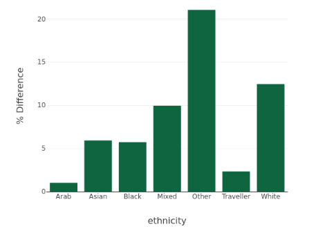
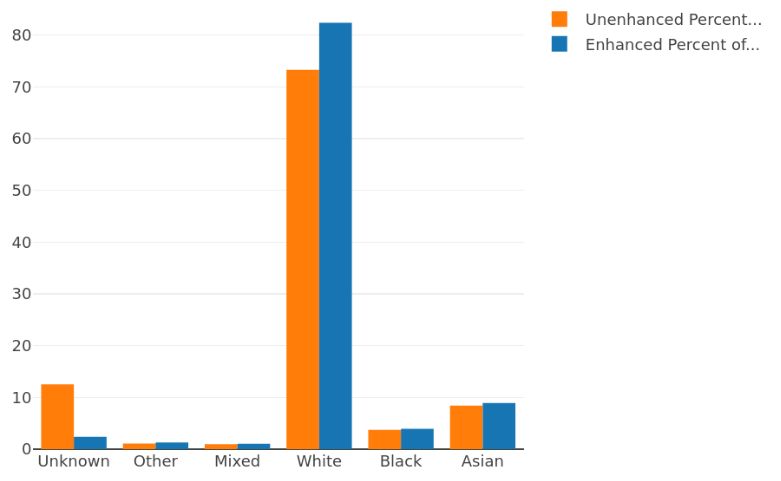
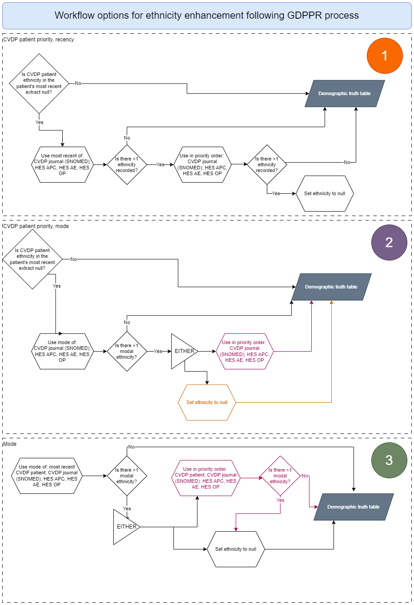

#Ethnicity enhancement algorithm

## Overview

This document describes the algorithm used to enhance ethnicity information for CVD PREVENT cohort patients.

- [Overview](#overview)
- [Inputs](#inputs)
- [Enhancement logic](#enhancement-logic)
      - [Background to GDPRR method](#background-to-gdprr-method)
    - [Effect of enhancement](#effect-of-enhancement)
  - [Alternative logic considered](#alternative-logic-considered)

## Inputs

The pipeline records ethnicity codes in several different input sources:

1. CVDP annual and quarterly data
  1. Ethnicity is recorded under ethnicity\_code  as well as via SNOMED codes in the journal column, due to differences in the way this data is supplied via primary care. For more information see [GDPPR\_Analytical\_Code/Ethnic\_Category at main · NHSDigital/GDPPR\_Analytical\_Code (github.com)](https://github.com/NHSDigital/GDPPR_Analytical_Code/tree/main/Ethnic_Category). Note that the CVDP equivalent to what GDPPR refers to as GDPPR.Patient and GDPPR.Journal are equivalent to ethnicity\_code  and the journal column.
2. HES Admitted Patient Care (APC), HES Accident & Emergency (AE) and HES Outpatients (HES OP)
  1. Ethnicity is recorded under ETHNOS (for more information see the data dictionary for HES)

Before introducing the demographic table stage, we relied on the ethnicity\_code provided in the most recent CVDP annual or quarterly record, with the assumption being that this was the most reliable (validated by the GDPPR team). Patients may well have the same ethnicity captured across all these data sources. However, there are some that do not. We can "enhance" the ethnicity records for patients with missing or inconsistent ethnicity records, looking to the other input datasets, and applying a logic outlined below.

## Enhancement logic

A consolidation exercise is required before ethnicity from additional datasets is recorded in the patient table, following the prioritisation laid out by [GDPRR subject matter experts](https://github.com/NHSDigital/GDPPR_Analytical_Code/tree/main/Ethnic_Category). We follow this prioritisation due to its accepted use in the publication of similar statistics, and our stakeholders (OHID) preference in order to use denominators that have been aggregated following this prioritisation.

However, as we do not have the same datasets used in the GDPPR exercise (most pertinently the dates refer to slightly different points in the process), we cannot exactly recreate it. We are also mindful that breakdowns of our data by ethnicity have already been published, and the stakeholders' preference was to only "enhance" ethnicity records for those with no ethnicity provided in the CVDP dataset.

The prioritisation and consolidation exercise in this stage is the following:

1. Patients with the following are eligible for enhanced ethnicity:
  1. Patients with no valid\* ethnicity value recorded against any of their CVDP records
  2. Patients with more than one ethnicity value recorded against their most recent CVDP record (not including null or invalid\* ethnicity values)
2. Null ethnicity codes not included in the following prioritisation ("removed") Certain exclusions (see below) are applied
3. Where conflicts exist between data sources priority is given in the following order: GDPPR-Journal, GDPPR-Patient, HES-APC, HES-AE, HES-OP.

  *"Z", "z", "X", "x", "99", "9", "", " " are all considered invalid ethnicity codes.

##### Background to GDPRR method

1. The guidance outlines two possible choices where there are either \>1 modes, or \>1 ethnicity records on the most recent date: either to set as null, or to take the record from a dataset in a given order of priority.  **The GDPPR team chose the former.**
2. The GDPPR team used  **recency, rather than modality** , as this led to the highest number of non-null ethnicity records.
3. The **most recent ethnicity value in the CVDP extract (i.e. GDPPR.patient) is likely to be more accurate** than previous values. It is unlikely that the ethnicity field in the CVDP extract is updated unless this is a correction. For journal entries, and HES data, this is not necessarily the case.
4. **We do not have a key date that the GDPPR team use to determine recency**. Using recency relies on having a date attached to the ethnicity field in the CVDP extract, which we do not have. If we used extract date, we would be setting it against a somewhat arbitrary date that wouldn't necessarily relate to when the record was last updated, and mean that this field was always selected over ethnicity recorded in journal entries.
5. Using mode, you need to  **only look at distinct CVDP ethnicity records**  as each CVDP extract does not necessarily constitute a separate ethnicity record. Additionally, the mode would place more weight on HES ethnicity for patients with many hospital visits.

#### Effect of enhancement

Records with unknown or invalid ethnicity amounted to approximately 1.8 million individuals. Enhancing ethnicity reduces this to approximately 350 thousand (1.5 million patients thereby have an 'enhanced' ethnicity). The increases to ethnicity groups (in percentages) vary across ethnic groups, and can be seen here:

 

Although the largest % increases can be seen in the 'Other' ethnicity categorisation, it should be noted that the vast majority of people in CVD-Prevent are recorded as 'A' ethnicity, and the largest increase of enhanced records are with 'A' ethnicity (see chart below). Proportionally however, this represents a larger increase for groups falling under 'Other' as well as 'Mixed'.

This has the effect of the proportion of total patients falling into the White ethnic group category increasing to just over 80%.

### Alternative logic considered

We considered several alternatives to the logic described above, illustrated in the diagram above.

The logic described above is **option 1**  in the diagram to the right of the page. It was agreed on as it is most similar to that done by GDPPR. Essentially this gives priority to the CVDP patient ethnicity (e.g. GDPPR.patient). It chooses the most recent alternative where this is null.

**Option 2** is similar to option 1, but uses mode in cases where this field is null.  **Options 1 and 2** would have the least effect on published data as only null records would be enhanced.

**Option 3** disregards the recency of CVDP patient ethnicity, and selects the mode across all datasets, giving priority in the order listed where \>1 mode is identified.

All options use the most recent CVDP patient ethnicity, as this is most likely to be accurate.

