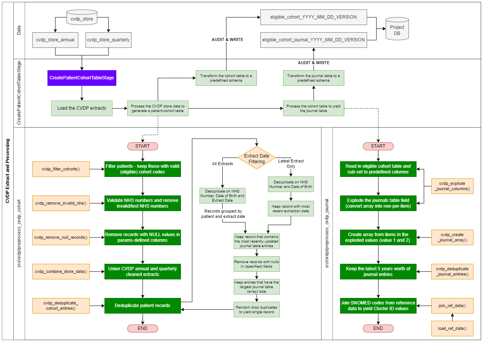

# CVDP Extract Processing

## Overview

This page details the processing of the CVDP (Cardiovascular Disease Prevent) extracts (annual and quarterly) and the processing of this to produce the cohort and journal tables.

- [CVDP Extract Processing](#cvdp-extract-processing)
  - [Overview](#overview)
  - [Definitions and Terms](#definitions-and-terms)
  - [Summary of Functionality](#summary-of-functionality)
  - [Methodology](#methodology)
    - [Process Flow of CVDP Extraction Processing to Cohort and Journal Tables](#process-flow-of-cvdp-extraction-processing-to-cohort-and-journal-tables)
    - [Method Overview](#method-overview)
  - [Assumptions and Limitations](#assumptions-and-limitations)
    - [Assumptions](#assumptions)
    - [Limitations](#limitations)

## Definitions and Terms

| **Term** | **Definition** |
| --- | --- |
| **CVDP** | Cardiovascular Disease Prevent. |
| **CVDP Annual** | CVDP data extract that is updated on an annual basis. The most recent CVDP annual table that is available has an extract date of March 2020. |
| **CVDP Quarterly** | CVDP data extract that is updated on a quarterly basis. |
| **Extract Date** | Date of extract from the CVDP data, for each record.  |
| **Cohort** | Patients are assigned a cohort code in the CVDP extract data. These cohorts are filtered on to produce the eligible patient list. Cohort definitions can be found [here](./cohort_definitions.md) and are described in more detail on this page.  |
| **Cohort Table** | Pipeline asset: a table that contains all patients from the CVDP data (annual and quarterly) that are in an eligible cohort. |
| **Journal Table** | Pipeline asset: a table containing the associated journal entry clusters, measurements and values for patients that are in the cohort table.  |

## Summary of Functionality

Extracting and processing the CVDP data involves the following areas/steps: Loading and transformining CVDP annual and quarterly data into a flat, reconciled table; filtering patients to retain those that are in eligible cohorts (cohort table); extract and process those patient's journal table entries (journal table).

- Data from the CVDP extracts are loaded into the pipeline stage CreatePatientCohortTableStage
  - The extracts are defined as annual and quarterly
  - Annual: Contains the CVDP patients extracted in March 2020
  - Quarterly: Contains all quarterly CVDP patient extractions (3-month period) from June 2020
- CVDP Extractions contain information about patients that have been identified from the CVD Prevent data, and contains the following data points:
  - NHS Number
  - Date of birth
  - Demographics (e.g. gender, address, date of birth)
  - GP Practice identifiers
  - Date of extraction
- The cohort and journal tables are defined below:
  - Cohort: A table of patients that have been identified from the CVDP extracts, filtered to only keep patient records that are in eligible cohorts
  - Journal: A table that contains the exploded contains of the journal\_table column in the CVDP extracts, for patients that are in the cohort table only. Journal table entries contain information on patient measurements (e.g. blood pressure readings) and include events prior to the first CVDP extraction (currently March 2020).

**Note on patients removal from different extraction dates**
Patients are only present in the CVD extracts if they are **(A)** alive,  **(B)** still identified as having/being at risk of CVD, and **(C)** still registered at an English practice. Once a patient has died, registered out of an English practice,  or has been treated and is no longer CVD-identified, they will not appear in the CVD extract. This means that a patient can appear in a CVD extract in one quarter but be absent from the proceeding quarters (if they have died or been treated to resolution).

## Methodology

A code flow is provided (below) that details the overall process of extracting, transforming, and saving the CVDP-derived assets: cohort and journal tables. Below is a more detailed overview of each processed stage and the methodology involved.

### Process Flow of CVDP Extraction Processing to Cohort and Journal Tables

### Method Overview

1. **Data: Loaded from the**  **cvdp\_store**  **database**
   1. Annual: cvdp_store.cvdp_store_annual
   2. Quarterly: cvdp\_store.cvdp\_store\_quarterly
2. **Cohort data: Run the**  **preprocess\_cvdp\_cohort**  **algorithm:**
   1. Initial stage: the annual table and the quarterly tables are processed seperately, but with identical methods
      1. Filter patients on the cohort code containing column, keeping only patients identified as cohort 01 or 02 (**CVDPCX001** and **CVDPCX002** respectively)
      2. Remove invalid NHS numbers (numbers identified as invalid from the dsp.udfs module, function NHSNumber) and NHS numbers identified as test numbers (hard-coded prefixes and exact matches in params)
      3. Remove records from the tables where the NHS Number (person\_id) and date of birth (birth\_date) columns contain any NULL values.
   2. Union stage: Take the cleaned and processed annual and quarterly tables and union to form a flat CVD extract file. Remove duplicates from the unioned asset. Duplicates are removed, using the NHS number and date of birth (person\_id and birth\_date, respectively) columns to partition the data on, in the following order (all deduplicated on the partition):
      1. Keep the record with the latest extract date (i.e. the latest record that the patient appeared in any CVD extract)
         **OR**
         Keep all records for patients and apply the deduplication process to sets of entries per-patient per-extract date
      2. Remaining duplicates: keep the record with the lastest journal table entry date (i.e. same extraction date, but one record has more up-to-date journal table entries than another)
      3. Remaining duplicates: Remove records where columns contain any NULL values.**Note:** this step is optional, in the default running of this process, no records are removed using this.
      4. Remaining duplicates: Keep the record with the largest journal\_table array size (i.e. the record with the largest number of journal table entries).
      5. Remaining duplicates: Unable to deduplicate further, keep one record at random.
   3. The processed, flattened, CVD extract of eligible patients is then passed back into the stage and used in the creation of the journal table
3. **Journal data: Run the**  **preprocess\_cvdp\_journal**  **algorithm:**
   1. Load the CVD extract (containing eligible patients only)
   2. Select fields required to create the journal table: a table containing the exploded contents of the journal\_table column (row-per-entry, many per patient)
   3. Explode the journal table array column into row-per-entry
   4. Each journal entry contains two values (also exploded) known as value 1 and value. This are combined into a single array column for the (now deduplicated) entry.
   5. Filter the keep the latest  **5 years** worth of journal entries
   6. Using SNOMED reference data, obtain the cluster identififer ( Cluster\_ID ) for each journal entries associated SNOMED code
   7. The processed, expanded, CVD journal table is then passed back into the stage and, alongside the cohort table, is audited and written to the database

## Assumptions and Limitations

### Assumptions

- At the point of a patient's extraction, their journal table contains almost all the patient's previous readings. In the case of blood pressure, this may only be the prior 15 months (to latest extraction date).

### Limitations

- CVD Extraction data is only available from March 2020 onwards
