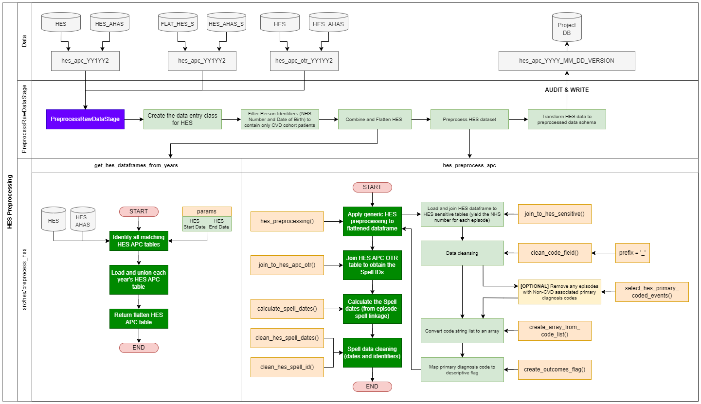

# HES Episodes and Spells

## Overview

This page details the [pre-processing](#hes-preprocessing) (Preprocess Raw Data stage) and the [processing](#hes-apc-processing-events-table)(Create Events Table stage) of the HES datasets.

- [HES Episodes and Spells](#hes-episodes-and-spells)
  - [Overview](#overview)
  - [HES Preprocessing](#hes-preprocessing)
    - [Summary of Functionality](#summary-of-functionality)
  - [Methodology](#methodology)
    - [Method Overview](#method-overview)
      - [Generic HES preprocessing function](#generic-hes-preprocessing-function)
      - [Specific HES APC preprocessing function](#specific-hes-apc-preprocessing-function)
      - [Code-Flag Mapping Definitions](#code-flag-mapping-definitions)
      - [Spell Validation Definitions](#spell-validation-definitions)
    - [Process Flow of HES Preprocessing](#process-flow-of-hes-preprocessing)
    - [Assumptions and Limitations](#assumptions-and-limitations)
      - [Assumptions](#assumptions)
      - [Limitations](#limitations)
  - [HES APC Processing (Events Table)](#hes-apc-processing-events-table)
    - [Summary of Functionality](#summary-of-functionality-1)
    - [Methodology](#methodology-1)
      - [Method Overview](#method-overview-1)
      - [HES Episodes processing function](#hes-episodes-processing-function)
      - [HES Spells processing function](#hes-spells-processing-function)
      - [Process Flow of HES Processing](#process-flow-of-hes-processing)
    - [Assumptions and Limitations](#assumptions-and-limitations-1)
      - [Assumptions](#assumptions-1)
      - [Limitations](#limitations-1)

## HES Preprocessing

### Summary of Functionality

- HES data is cleaned, processed and standardised for pipeline use in the [PreprocessRawDataStage](./pipeline_stages.md#preprocess-raw-data-stage) and is used for the creation of the events table (where further processing occurs to split episodes and spells) and integration into the patient table
- HES consists of a table per financial year which must be flattened into a single table that spans from the params-defined HES start year to end year
- The majority of the HES data can be found in the hes database, up until 2021. From 2021 onwards, the HES data is now stored in hes\_ahas. Additionally, the tables from hes and hes\_ahas does  **not** contain sensitive information such as NHS Number (used in the pipeline linkage). The tables must be linked to the respective tables in the sensitive versions of the main databases: flat\_hes\_s  and hes\_ahas\_s
- HES APC, HES OP and HES AE are separately retrieved and processed, using very similar processes with slight variations, detailed in the pages of the diagram below.
- The pre-processing is responsible for:
  - Combining the tables (one per financial year) of HES APC and HES APC OTR into single, flat tables that span the desired years. HES\_APC\_OTR files are needed to retrieve _spell _information associated with each episode.
  - In addition to creating the flat table, the associated tables from the HES sensitive databases (flat\_hes\_s for hes; hes\_ahas\_s  for hes\_ahas)
  - Filtering the patients to keep only those that are specified from CVDP extracts (the table output of CreatePatientCohortTableStage) The patient list is defined as all patients ever to be included in a CVDP extraction
  - Cleaning the HES data (NHS number cleaning and reconciliation)
  - Categorisation of the HES episodes that relate to specific CVD diagnoses as defined using the code column (containing ICD10 codes) and mapping those to flags (defined in params). Flags, and the associated codes, are defined in the methodology section below.

## Methodology

A code flow is provided (below) that details the overall process of extracting, transforming, and saving the HES data asset. Below (next section) is an overview of the preprocessing method, step-by-step.

### Method Overview

#### Generic HES preprocessing function

_(using HES APC as an example)_

1. Data: APC tables loaded from the HES assets
    1. Pre-2021: hes.hes\_apc\_YY1YY2
    2. 2021 onwards: hes\_ahas.hes\_apc\_YY1YY2
2. Flatten and Join: Flatten the loaded APC tables, join with the sensitive HES tables
   1. Pre-2021: flat\_hes\_s.hes\_apc\_YY1YY2
   2. 2021 onwards: hes\_ahas\_s.hes\_apc\_YY1YY2
3. (OPTIONAL): Remove any HES events that do  **not** have a CVD related ICD-10 code in the primary diagnostic code field
4. Clean the code fields and convert to array field (using prefixes stated below)
5. Applying flag mapping (see [Code-Flag Mapping Definitions](#code-flag-mapping-definitions) table for mapping values)

#### Specific HES APC preprocessing function 

1. Data: APC OTR tables loaded from the HES assets
    1. Pre-2021: hes.hes\_apc\_otr\_YY1YY2
    2. 2021 onwards: hes\_ahas.hes\_apc\_otr\_YY1YY2
2. Flatten and Join: Flatten the APC OTR tables and join to the HES data frame (output from the generic processing function)
3. Calculation: Using the SPELL identifiers obtained from APC OTR, calculate the spell details (spell start and end dates) for the HES episodes
4. Cleaning and Validation: Clean and validate the additional spell information, such as dates and spell identifiers (see [Spell Validation Definitions](#spell-validation-definitions) table for details on what is cleaned/validated)
5. Output dataframe (passes to the [PreprocessRawDataStage](./pipeline_stages.md#preprocess-raw-data-stage) for the final formatting and saving of the data asset)

**Specific HES AE preprocessing function**

1. Create a field (equivalent to DIAG3\_CONCAT in HES APC and HES OP) that is a concatenated list of diag code values. This does not already exist in HES AE. A function, create\_list\_from\_codes  has been created to do this.
2. Diag code values are recorded in fields with a slightly different name to HES APC and HES OP. These diag code field names look like DIAGX\_01 , instead of DIAG\_X\_01  in HES APC and HES OP. This has been accounted for by passing a prefix of '\_' into the clean\_code\_field() function for HES APC and HES OP, and a prefix of '' (blank) for HES AE.

#### Code-Flag Mapping Definitions

| **Flag Value** | **ICD-10 Code(s)** | **Description** |
| --- | --- | --- | 
| STROKE | I61, I63, I64 | Specifies when a user has had a stroke event |
| HEARTATTACK | I21, I22 | Specifies when a user has had a heart attack event |
| CVD\_OTHER | I01,I02,I03,I04,I05,I06, I07,I08,I09,I10,I11,I12, I13.I14,I15,I20,I23,I24,I25,I60,I65,I66,I67,I68,I69 | Specifies when a user has had another CVD related Primary Diagnosis |
| CVD\_NON\_PRIMARY | Same as all of above | Specifies when a user has had a CVD Related Secondary Diagnosis |
| NO\_CVD | All other codes | NO CVD Codes Are Found within the patients primary / secondary diagnoses |

#### Spell Validation Definitions

| **Type** | **Value** | **Description** | **Action** |
| --- | --- | --- | --- |
| Spell ID | -1 | Defined as an invalid/unable to spell episode | Replace with NULL  |
| Spell Date (Start \|\| End) | 1800-01-01 | Placeholder date from HES to define where no date was supplied | Replace with NULL  |
| Spell Date (Start \|\| End) | 1801-01-01 | Placeholder date from HES to define where a date was supplied but was invalid | Replace with NULL  |
| Spell Date (Start \|\| End) | 9999-01-01 | Date added during pipeline run to represent a NULL or invalid date placeholder. Used during the filtering/processing step to aid in date calculations. | Replace with NULL  |

### Process Flow of HES Preprocessing

### Assumptions and Limitations

#### Assumptions

- HES records are filtered to contain only those that match patient's from the CVDP extract (using NHS Number and Date of Birth)
- HES episodes are linked to a spell using the spell ID from the HES APC OTR table
  - HES APC and HES APC OTR are linked using the EPIKEY column found in both tables
- Records that occur before the pipeline start date (params.start\_date) and end date (params.end\_date) are removed
- HES codes (primary diagnostic code) are identified and processed from the DIAG\_04 column
  - These are matched to the ICD-10 codes in params\_diagnostic\_utils, used to identify CVD related events, on the first 3 code characters

#### Limitations

- Linking is currently only on NHS Number and Date of Birth (linked from the CVD cohort extract - eligible\_cohort)
- HES Episode-to-spell linkage requires episodes, mapped using EPIKEY, to have an associated non-null Spell ID. Without a Spell ID these episodes cannot be linked and therefore will not appear in any HES Spell event records.
  - As of 2023 04 14, 0.04% of HES Episodes link to a null Spell ID or a Spell ID of -1 (defined as an unspellable episode)

## HES APC Processing (Events Table)

### Summary of Functionality

- The HES APC preprocessed data asset is loaded into the CreateEventsTableStage
- The HES APC data is then split into HES Episodes and HES Spells (two seperate events data entry objects) using two different functions from src/hes::process\_hes\_events
  - HES Episodes = process\_hes\_events\_episodes()
    - HES Episodes are selected from the raw data directly - no processing is applied (apart from selecting the relevant columns for the events table
  - Hes Spells = process\_hes\_events\_spells()
    - HES Spells are calculated from the HES Episodes using the associated Spell ID (derived from HES APC OTR) that links episodes (episode IDs) to a single spell (Spell ID)
    - Flags are added to each spell depending on the conditions of the episode primary and associated diagnostic codes, please see method below for specific flag values
    - Note: episodes are processed so that spells spanning financial years (e.g. a spell that starts in February 2020 and finishes in May 2020 - two seperate financial years) are counted as a single spell
- These two (seperate) dataframes are then formatted to the event table schema and added as events, with the following field values assigned to each dataset:
  - HES Episodes: dataset = hes\_apc; category = episode
  - HES Spells: dataset = hes\_apc; category = spell

Episodes and spells are not disaggregated for HES AE and HES OP datasets, and these preprocessed data assets are NOT loaded into the CreateEventsTableStage.

### Methodology

A code flow is provided (below) that details the overall process of processing the HES APC preprocessed data asset into HES Episode and Spell events (in the events table). Below (next section) is an overview of the processing method, step-by-step.

#### Method Overview

#### HES Episodes processing function

1. Fields params.HES\_SPLIT\_EPISODES\_COLS are selected from the HES APC preprocessed data asset
2. Return dataframe to the events table stage

#### HES Spells processing function

1. Fields params.HES\_SPLIT\_SPELL\_COLS are selected from the HES APC preprocessed data asset
2. HES entries (episodes) are filtered to remove any episodes with null spell ids (unable to be identified from linkage in HES APC OTR)
3. HES entries are combined, from the associated spell id, into single spell events (collection of associated HES entries)
    1. Primary diagnostic codes for all episodes are concatenated into a single spell-associated code array
    2. Flags for all episodes are concatenated into a single spell-associated flag array
**Note:** If multiple flags of interest (where the flag was STROKE, HEARTATTACK, CVD\_OTHER or CVD\_NON\_PRIMARY) are assigned a flag value, for the spell, of MULTIPLE - the original episode flags can be queried in the associated flags column
 **Note:** The MULTIPLE flag is only applied when the patient has multiple CVD related flags, multiple 'NO\_CVD' Flags will result in a 'NO\_CVD' output flag.
4. These spell entries are then deduplicated to keep a single, unique spell entry (with all the associated codes and flags)
**Note:** the LSOA field is also deduplicated to keep the latest LSOA (the LSOA assigned to the latest episode of a spell) for the respective HES spell event
5. Return dataframe to the events table stage

#### Process Flow of HES Processing

The HES Episode and Spell processing process is documented in [Pipeline Stages - Create Events Table Stage](./pipeline_stages.md#create-events-table-stage).

### Assumptions and Limitations

#### Assumptions

- Assumptions at the HES preprocessing stage also apply

#### Limitations

- HES Episodes can only be linked to spells where a spell ID (in the HES preprocessed asset) is present
- Limitations at the HES preprocessing stage also apply
