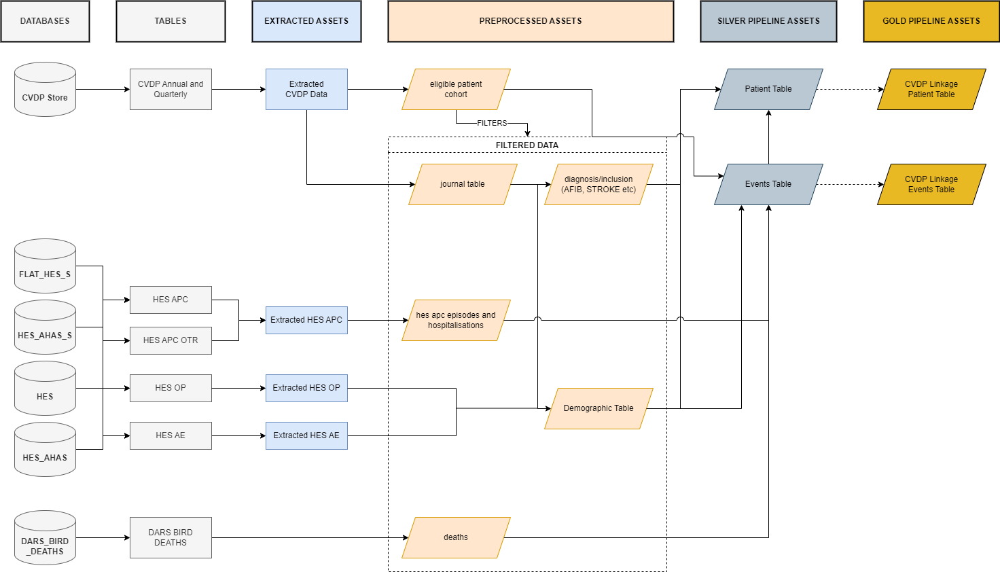

# Pipeline Assets

## Overview

The CVD Prevent Tool pipeline ingests raw datasets to produce a set of intemeditary, processed data. These datasets are then combined into an events table, which is then processed into a summary table: the patient table. These two tables are then futher refined into the shareable events and patient tables: this is the step of pseudoanonymisation and dropping/processing of any sensitive fields.

- [Pipeline Assets](#pipeline-assets)
  - [Overview](#overview)
  - [Data Dictionary File](#data-dictionary-file)
- [Assets Process Flow (Bronze, Silver, Gold)](#assets-process-flow-bronze-silver-gold)
  - [Events Table](#events-table)
- [Patient Table](#patient-table)

## Data Dictionary File

[Data Dictionary for the disseminated data tables](./CVD_prevent_tool_product-spec_v1.4_extended.2.xlsx)

# Assets Process Flow (Bronze, Silver, Gold)

Assets in the pipeline can be broadly categorised into three groups:

**Bronze**

These are the cleaned, filtered and processed raw data assets. They are the pipeline assets that are produced as part of the CreateEligibleCohortStage and PreprocessRawDataStage pipeline stages. The raw data processed to produce these assets include  **HES, DARS,** **PCAREMEDS,** **CVDP Annual** and **CVDP Quarterly** extracts.

**Silver**

These are the combined **bronze** assets, and represent patient event records (e.g. blood pressure measurements) and summarisations of patient event history. These are the **events** and **patient** table respectively.

**Gold**

These are the final tables that are shareable with cleared teams. The assets are curated (desensitised) and psuedoanonymised versions of the  **events** and  **patient** tables.

## Data Flow (high-level)

Below is a high-level overview of how the data flows through the pipeline, is preprocessed and ultimately processed into the silver and gold assets

## Dataset Notes
**HES**

HES contains the individual hospital episodes alongside the hospital spells.

Spells are composed of episode(s).

Episode and spell data is loaded from the HES APC tables, combining sensitive and non-sensitive HES table, for each year. Each year is then combined with the other HES tables for multiple years (year range defined in params).

Spell information is contained in the HES APC tables, but the Spell ID (unique identifier for each hospitalisation spell) is contained in the HES APC OTR table. This table is processed (union of multiple years) to obtain the Spell ID (unique identifier for each hospitalisation spell).

An overview of the HES pre-processing and event selection (part of the Create Events Table Stage) is detailed in the [HES episodes and spells documentation](./hes_episodes_spells.md).

## Events Table

The events table is a long-format table, where each row is an event (many rows per-patient). Each event (row) is identified with the dataset (database) and category (contextual) information. For example, a hospital spell (a stay in hospital made up of individual episodes) would have a dataset value of hes\_apc and a category of spell.

The data spec for the events table is given below.

| **Display Name** | **Database Field Name** | **Field Description** | **Sensitive Field** | **Identifiable Field** | **Field Type** | **Nullable Field** |
| --- | --- | --- | --- | --- | --- | --- |
| **Patient ID** | patient\_id | Patient pseudo id | No | No | Int | FALSE |
| **Date of birth** | birth\_date | Date of birth as recorded at source | **Yes** | **Yes** | Date | FALSE |
| **Age** | age | Age on event date | No | No | Int | TRUE |
| **Sex** | sex | Sex as recorded at source | No | No | String | TRUE |
| **Data source** | dataset | Data source event originated from | No | No | String | FALSE |
| **Category** | category | Event categorisation information | No | No | String | FALSE |
| **Record ID** | record\_id | Unique record identifier | No | No | Int | FALSE |
| **Event start date** | record\_start\_date | Event start date | No | No | Date | FALSE |
| **Event end date** | record\_end\_date | Event end date, same as start date if event occurred within a single day.  | No | No | Date | TRUE |
| **LSOA** | lsoa | LSOA on event date | No | No | String | TRUE |
| **Ethnicity** | event\_source\_ethnicity | Ethnic group at source event | No | No | String | TRUE |
| **Inclusion code** | code | Inclusion diagnostic code (SNOMED, ICD10, datasource flag) | No | No | String | TRUE |
| **Flag** | flag | Event categorisation information | No | No | String | TRUE|
| **Code Array** | code\_array | List of codes that are associated with the record (e.g. additional SNOMED, ICD10 codes) but are not the primary code for the event | No | No | String | TRUE |
| **Associated flag** | flag\_assoc | List of flags that are associated with the record, but are not the primary flag for the event. For episodes, this column contains theadmission method flag. | No | No | String | TRUE |
| **Associated record ID** | record\_id\_assoc | List of record identifiers that are associated with the event. These record identifiers relate to another event (on record\_id) in the events table.  | No | No | String | TRUE |

# Patient Table

The patient table is a wide-format table, where each row is a unique patient, with columns detailing patient information, demographic information, and summaries of patient history (e.g. number of hospitalisations with a primary code of stroke).

The data spec for the patient table is given below.

| **Display Name** | **Database Field Name** | **Field Description** | **Sensitive Field** | **Identifiable Field** | **Field Type** | **Nullable Field** |
| --- | --- | --- | --- | --- | --- | --- |
| **Patient ID** | patient\_id | Patient pseudo id | No | No | Int | FALSE |
| **Date of birth** | birth\_date | Date of birth from patient's latest CVDP extract | **Yes** | **Yes** | Date | FALSE |
| **Extract Date** | latest\_extract\_date | Latest extraction date for a patient (from the CVDP extract) | No | No | Date | FALSE |
| **Practice Identifier** | latest\_practice\_identifier | GP practice identifier code from latest CVDP extract.  | **Yes** | No | String | FALSE |
| **Sex** | sex | Sex from patient's latest CVDP extract | No | No | String | TRUE |
| **LSOA** | lsoa | LSOA from patient's latest CVDP extract | No | No | String | TRUE |
| **cohort** | cohort | Cohort flag from patient's latest CVDP extract | No | No | String | FALSE |
| **Ethnicity** | ethinicity | Ethnic group from patient's latest CVDP extract\* | No | No | String | TRUE |
| **xxx Diagnosis Date** | xxx\_diagnosis\_date | Earliest diagnosis date for xxx, null if no xxx diagnosis available | No | No | Date | TRUE |
| **Date of Death** | date\_of\_death | Date of Death, null if not available | No | No | Date | TRUE |
| **Death flag** | death\_flag | Flag for primary cause of death is Heart Attack, Stroke or other CVD, null if date of death not available | No | No | String | TRUE |
| **Death age flag** | death\_age\_flag | Under 75 or 75 +  at time of death, null if date of death not available | No | No | Int | TRUE |
| **Stroke hospitalisation count** | stroke\_count | Total number of hospitalisation spells with stroke as a primary diagnosis in at least one of the episodes | No | No | Int | TRUE |
| **Latest stroke hospitalisation date** | max\_stroke\_date | Admission date of latest hospitalisation spell with stroke as a primary diagnosis in at least one of the episodes | No | No | Date | TRUE |
| **MI hospitalisation count** | mi\_count | Total number of hospitalisation spells with heart attack as a primary diagnosis in at least one of the episodes | No | No | Int | TRUE |
| **Latest MI hospitalisation date** | max\_mi\_date | Admission date of latest hospitalisation spell with heart attack as a primary diagnosis in at least one of the episodes | No | No | Date | TRUE |
| **Died within 30 days of hospitalisation flag** | died\_within\_30\_days\_hospitalisation\_flags | Flag if patient's date of death is within 30 days of a stroke or heart attack hospitalisation | No | No | Int | TRUE |
| **Hypertension risk group** | hyp\_risk\_group | Hypertension patient risk group calculated at patient's latest CVDP extract | No | No | Int | TRUE |

\* This is the case if the demographic enhancement switch is set to FALSE. If enhanced switch is set to TRUE, the ethnicity is taken fro the patient's latest CVDP extract. Where this is null, ethnicity is [enhanced](./ethnicity_enhance.md) from additional datasets.

