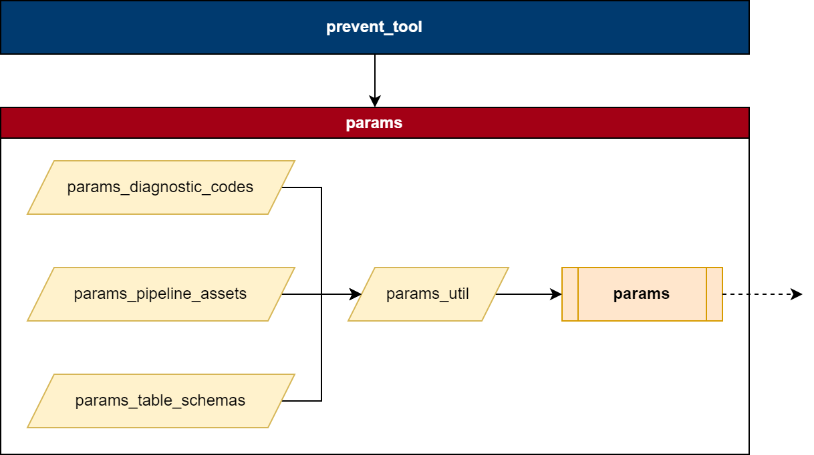

# Pipeline Overview

- [Pipeline Overview](#pipeline-overview)
  - [Pipeline Stages](#pipeline-stages)
  - [Pipeline Diagram](#pipeline-diagram)
  - [Controlling the pipeline - Params](#controlling-the-pipeline---params)
    - [Parameter Notebook Definitions](#parameter-notebook-definitions)
  - [Running the Pipeline](#running-the-pipeline)

The pipeline is constructed using three classes (python: object-orientated-programming):

- Stages (PipelineStage): These form the main pipeline (default\_pipeline\_stages). Stages (A) process data, (B) link to other stages, and (C) output data in the form of pipeline assets
- Context (PipelineContext): The context is responsible for passing information and data between stages and assets in the pipeline
- Assets (PipelineAsset): Assets are data objects consumed and created by each pipeline stage. These are also used to write data to the local database environment.

## [Pipeline Stages](./pipeline_stages.md)

Pipeline stages are ordered as they appear in default\_pipeline.

1. **CreatePatientCohortTableStage**
CVDP data (quarterly table) is processed and filtered on the inclusion criteria (defined in params/params) to generate a table of eligible patients used for cohorting (eligible\_cohort).
1. **PreprocessRawDataStage**
 Raw data assets (e.g. HES) are extracted, transformed, and loaded (ETL) into the pipeline context (and saved to intermediate tables).
 The datasets are cleaned, preprocessed and filtered (using the eligible patient cohort).
1. **CreateEventsTableStage**
Pre-processed data assets are loaded and processed into a row-per-event table.
 Patient IDs are not unique (multiple events per patient).
1. **CreateDemographicTableStage**
 Pre-processed data assets (e.g. HES AE & OP), as well as events from the events table are loaded and processed into a row-per-patient table.
 Only patient IDs and selected demographic information (e.g. ethnicity) is retained.
 Patient IDs are unique.
1. **CreatePatientTableStage**
Events from the events table are combined and processed into a row-per-patient table.
 Patient IDs are unique.
 Additional information is added to the patient table (derived from the events table) in the form of diagnostic flags, diagnostic dates and other calculated information.

## Pipeline Diagram

Detailed here is a summary of the pipeline, how the stages and data assets link together.

## Controlling the pipeline - Params

The pipeline is built so that no codebase changes should be required to alter the running and configuration of the pipeline.

The pipeline is controlled by the [params](../params/params.py) notebook. The notebook calls from multiple notebooks (see diagram below) to form the params class - a dataclass. 

Below is a summary diagram of how params is (A) constructed and (B) the notebooks used to build it (with definitions).

This notebook contains:

- Pipeline logic and version control paramters (e.g. date, git hash)
- Database locations, including table names
- Column and field identifiers for raw data assets
- Column and field identifiers for assets create by the pipeline
- Collections of params variables, defined in the \_\_post\_init\_\_ section of the params
  - This is where variables that require access to  **member variables** are coded. Member variables are variables defined within the dataclass that are themselves used to build other variables/parameters in the same dataclass.

[Params](../params/params.py) is then called by the various pipeline stages and the codebase, and these variables are used to run the pipeline and produce the desired assets.

The parameters object, as defined in the pipeline codebase, is known as the  **default** parameters - the set of parameters used for the normal (default) running of the pipeline.

This is specified by setting the variable PARAMS\_PATH to 'default' before running the params notebook (%run params).

If this path is not set, then the notebook will error out when attempting to run.

[Params](../params/params.py) contains a definition of the global joining key - the column(s) that are used to link the data assets in the pipeline. This is defined in the variable GLOBAL\_JOIN\_KEY and is currently set to the **NHS Number** (params.PID\_FIELD) and **Date of Birth** (params.DOB\_FIELD).

### Parameter Notebook Definitions

**[params](../params/params.py)**

The main notebook used to call and create the params class. Imports [params\_util](../params/params_util.py) and requres the definition of PARAMS\_PATH to execute successfully.

If PARAMS\_PATH is not 'default', then the params will be loaded from a custom (copy) version of [params\_util](../params/params_util.py).

**[params\_util](../params/params_util.py)**

This is the "main" parameters notebook. It is where the dataclass is defined, and all the variables (excluding any clinical codes) are defined. This notebook is run by params and reads in params\_diagnostic\_codes.

**[params\_diagnostic\_codes](../params/params_diagnostic_codes.py)**

This notebook  **only** contains definitions of clinical coded variables. Currently, these are limited to SNOMED and ICD-10 codes.

## Running the Pipeline

The pipeline is run by the run\_pipeline notebook. For full details on running the pipeline visit [running the pipeline](../documentation/running_the_pipeline.md).
