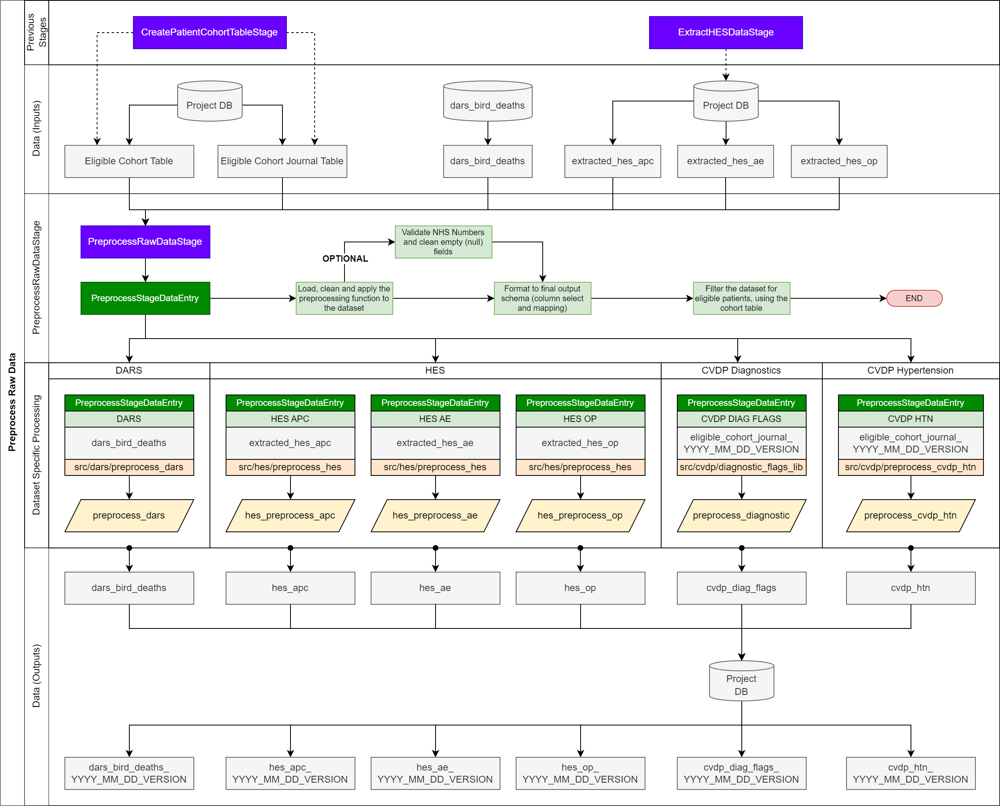

# Pipeline Stages

# Outline

- [Overview](#overview)
- [Pipeline Stages: Class Definitions](#pipeline-stages-class-definitions)
- [Pipeline Classes Interaction Diagram](#pipeline-classes-interaction-diagram)
- [Pipeline Stages Breakdown](#pipeline-stages-breakdown)

  

## Overview

The pipeline is defined as a set of pipeline stages, chained together to consume raw data assets, and are defined (running order) in [default\_pipeline](../pipeline/default_pipeline.py).

Each pipeline stage is defined in its own notebook within the pipeline folder. Each pipeline stage is imported into default\_pipeline for running.

## Pipeline Stages: Class Definitions

Pipeline stages are classes that are built using the base pipeline classes.
The stages inherit (parent) the attributes and methods of the base class (child) - the PipelineStage class.
Each stage also produces assets, that are eventually wrapped in the PipelineAssets class.
These assets, alongside the parameters and other stages, are all accessed from the pipeline context (built from PipelineContext. Please see the diagram (left) for a schematic of how these interact to form the pipeline.

These pipeline classes interact and form the entire pipeline. As shown, the params is passed to each stage and is used to control the pipeline stage and associated methods.

## Pipeline Classes Interaction Diagram

# Pipeline Stages Breakdown

The pipeline consists of four main stages (see [Pipeline Overview](./pipeline_overview.md). These stages are broken down into more detail in the sections below.

## Create Patient Cohort Table Stage

### Stage Details

[CreatePatientCohortTableStage](../pipeline/create_cohort_table.py) is responsible for:
1. Loading the annual and quarterly extracts from the CVDP\_store database
2. Cleaning and preprocessing these data sources into:
  a. Eligible Cohort Table: List of patients, deduplicated to keep their latest (extract date) record, with cohort and demographic information
  b. Eligible Cohort Journal Table: Associated journal table (from: journal\_table) for the eligible cohort patients, containing measurements and diagnosis information
3. Mapping the schema from the inputs to the standarised column names (see params)

#### Parent class
 [PipelineStage](../pipeline/pipeline_util.py)  

#### Associated Notebooks
- [Pipeline parameters](../params/params.py)
- [Pipeline utilities (including parent class)](../pipeline/pipeline_util.py)
- [Stage-specific functions](../pipeline/preprocess_raw_data_lib.py)
- [Generic dataframe cleaning and processing](../src/clean_dataset.py)
- CVDPREVENT dataset-specific preprocessing functions:
  - [cohort](../src/cvdp/preprocess_cvdp_cohort.py)
  - [journal](../src/cvdp/preprocess_cvdp_journal.py) 

Associated Technical Documentation

[CVDP Extract Processing](./extract_processing.md)

### Stage Overview

The  **Create Patient Cohort Table** stage processes the two CVD Prevent (CVDP) extracts and processes patient records from the CVDP annual and quarterly tables.

These two tables contain patients that have been identified in CVDP:

- Annual: contains the snapshot taken from the CVDP patient database. This snapshot contains eligible patients (alive  **and** not-resolved of CVD) at the time of extraction:  **March 2020**.
- Quarterly: contains the quarterly (~3 month) snapshots from the CVDP patient database. These snapshots contain eligible patients (alive  **and** not-resolved of CVD) at the time of extraction. The latest extraction is currently **March 2024**.

The final output from these two tables is a flat CVDP extract dataframe that is the union of the annual and quarterly tables. This is then deduplicated, ensuring a single event per-patient, per-extract-date, is kept.

These extracts also contain a column journal\_table that contains all journal entries at the point of extraction. This column is a struct data type, containing rows of journal table entries (e.g. blood pressure measurements). For each patient, the latest extract from the flat CVDP dataframe is extracted and exploded (into single rows) to form the journal table.

### Stage Diagram

## Preprocess Raw Data Stage

### Stage Details

 [PreprocessRawDataStage](../pipeline/preprocess_raw_data.py) is responsible for:
1. Loading the raw data sources into dataframes
2. Cleaning and preprocessing those dataframes
3. Filtering the data on the patient cohort table (created in the CreatePatientCohortTable stage)

#### Parent class
 [PipelineStage](../pipeline/pipeline_util.py)  

#### Associated Notebooks

  - [Pipeline parameters](../params/params.py)
- [Pipeline utilities (including parent class)](../pipeline/pipeline_util.py)
- [Stage-specific functions](../pipeline/preprocess_raw_data_lib.py)
- [Generic dataframe cleaning and processing](../src/clean_dataset.py)
- Dataset-specific preprocessing functions:
  - [diagnostic flags](../src/cvdp/diagnostic_flags_lib.py)
  - [hypertension](../src/cvdp/preprocess_cvdp_htn.py) 
  - [death registration](../src/dars/preprocess_dars.py) 
  - [Hospital Episode Statistics](../src/hes/preprocess_hes.py) 

[Hospital Episode Statistics (HES) Datasets](https://digital.nhs.uk/data-and-information/data-tools-and-services/data-services/hospital-episode-statistics)

HES datasets are provided as a table per financial year ( **YY1 **= starting financial year;** YY2** = ending financial year). Tables are combined into a single, flat HES file.
 HES tables are also split into pre-2021 and 2021-onwards tables (hes/flat\_hes and hes\_ahas/hes\_ahas\_s respectively).
 HES tables containing identifiable information have the suffix \_s and are joined to non-sensitive HES tables to provide patient identifiers.

#### Associated Technical Documentation

- [CVDP Diagnostic Flags](./cvdp_diagnostic_flags.md)
- [CVDP Hypertension](./cvdp_hypertension.md)
- [DARS Deaths](./dars_death.md)
- [HES Episodes and Spells](./hes_episodes_spells.md)

### Stage Overview

The  **Preprocess Raw Data** stage ingests the raw data assets (HES, DARS) and the outputs of  **Create Patient Cohort Table** stage (cohort and journal tables) and produces a set of cleansed, validated (NHS numbers) and processed (using the respective functions found in the src/\* notebooks) pipeline data assets.

The assets are described below:

**HES APC**

- Hospital Episode Statistics Admitted Patient Care (HES APC) data are collected on all admissions to National Health Service (NHS) hospitals in England. HES APC also covers admissions to independent sector providers (private or charitable hospitals) paid for by the NHS.

**HES AE**

- Hospital Episode Statistics Accident and Emergency Care (HES AE) data are collected on all A&E activity at National Health Service (NHS) hospitals in England. 

**HES OP**

- Hospital Episode Statistics Outpatient Care (HES OP) data are collected on all Outpatient appointments in National Health Service (NHS) hospitals in England. 

**DARS**

- Deaths registration data (all deaths in England and Wales) collected from The Registrar General for England and Wales. Record-level patient data set, where a record represents one death registration.

**CVD Diagnostics**

- The journal table (output of  **Create Patient Cohort Table** ) is processed to identify and extract any [patient-specific diagnostic events](./cvdp_diagnostic_flags.md) (e.g. latest date of an active atrial fibrillation diagnosis)..

**CVD Hypertension**

- The journal table (output of  **Create Patient Cohort Table** ) is processed to identify and extract any **valid** [blood pressure measurements and assign a hypertension risk group to them](./cvdp_hypertension.md).

### Stage Diagram

## Create Events Table Stage

### Stage Details

[CreateEventsTableStage](../pipeline/create_events_table.py) is responsible for:
1. Loading each of the pre-processed raw datasets
2. Formatting the assets into a common schema and unioning to form the events table - this process involves mapping the input data asset fields to the output fields of the final events table
3. Applying any asset specific functions during the events-table processing (e.g. splitting a single dataset into multiple datasets per category - for example splitting hes into hospitalisation episodes and spells)
4. Creating a union of the formatted and mapped datasets to form the events table
 

#### Parent class
 [PipelineStage](../pipeline/pipeline_util.py)  

#### Associated Notebooks

- [Pipeline parameters](../params/params.py)
- [Pipeline utilities (including parent class)](../pipeline/pipeline_util.py)
- [Stage-specific functions](../pipeline/preprocess_raw_data_lib.py)
- Stage-specific functions
  - [events_table](../pipeline/create_events_table.py) pipeline/create\_events\_table
  - [events_table](../pipeline/create_events_table_lib.py) 
  
- [Generic functionality](../src/util.py)
- Dataset-specific preprocessing functions:
  - [Hospital Episode Statistics](../src/hes/preprocess_hes.py) 

#### Associated Technical Documentation

[Pipeline Assets](./pipeline_assets.md)

### Stage Overview

The  **Create Events Table** stage creates the [events table](./pipeline_assets.md) by combining the pre-processed data assets into a single, long-format table. Each row is an unique event, with an associated dataset (e.g. hes) and category (e.g. hospitalisation) that characterises the event types.

Currently there are the following dataset-category pairings:

| **Dataset** | **Category** | **Description** |
| --- | --- | --- |
| **cvdp\_cohort** | cohort\_extract | Cohort extraction events from the (flattened and deduplicated) CVD annual and quarterly extracts. Cohort events contain information regarding the CVD cohort status (cohort code/group) at the time of extraction (record\_start\_date). Each cohort event has the associated patient demographic information (ethnicity, lsoa, sex) alongside patient identifiers (e.g. date of birth) and the associated practice identifier (code\_array). |
| **cvdp\_htn** | bp | Blood pressure measurements extracted from the journal table, for eligible patients (identified from the eligible cohort table). Blood pressure measurements contain the date of the measurement record (journal entry date), the systolic and diastolic values (stored as a combined string in code, individual values in code\_array). Each blood pressure measurement is flagged with a hypertension risk group.   |
| **hes\_apc** | episode | HES (APC) episode events are individual episodes extracted from the processed HES APC tables. Each event is assigned a primary diagnostic code (code) and an array of non-primary diagnostic codes (code\_array). A flag is added (flag) if the episode had a primary diagnostic code that was CVD related (e.g. HEARTATTACK, STROKE), a flag added for events with CVD as a non-primary (associated) code (CVD\_NON\_PRIMARY) and no flag (null) where CVD related diagnostic codes have not been found in the event.  |
| **hes\_apc** | spell | HES (APC) spell events are events that represent a collection of episodes. For example, a spell may contain several episodes, and the spell start and end dates will will the start date of the first episode to the last date of the last episode.  Spells have flags associated with them (flag) that represent if there were episode(s) that related to heart attacks (HEARTATTACK), stroke (STROKE) or had multiple distinct CVD events (MULTIPLE).  |
| **dars\_bird\_deaths** | death | DARS events are patient death events and only appear if a patient has died. These events are flagged if the underlying cause of death codes (ICD10) contain any CVD related codes: they are flagged with the respective CVD death outcome (e.g. HEARTATTACK).  |

The events table is used to create the base (non-enriched) patient table, and can be linked to the patient table on the primary key of person\_id, birth\_date.

### Stage Diagram

## Create Demographic Table Stage

### Stage Details
[CreateDemographicTableStage](../pipeline/create_demographic_table.py) is responsible for:
1. Loading the events table and additional datasets (e.g.  journal table, HES OP and HES AE)
2. Identifying patients with and without relevant demographic information from the most reliable source (CVDP patient)
3. For those without, enhancing the demographic information from additional datasets
4. Producing a demographic table with all patient IDs, with one record per patient (either original or enhanced demographics)

#### Parent class
 [PipelineStage](../pipeline/pipeline_util.py)  

#### Associated Notebooks

- [Pipeline parameters](../params/params.py)
- [Pipeline utilities (including parent class)](../pipeline/pipeline_util.py)
- [Stage-specific functions](../pipeline/preprocess_raw_data_lib.py)
- Stage-specific functions
  - [demographic_table](../pipeline/create_demographic_table.py) pipeline/create\_events\_table
  - [library](../pipeline/create_demographic_table_lib.py) 
  - [for extract patient events only](../pipeline/create_patient_table_lib.py)  
- [Generic functionality](../src/util.py)

 
### Stage Overview

The  [Create Demographic Table](../pipeline/create_demographic_table.py) stage creates the demographic table by combining pre-processed data assets into a single, long-format table. Each row is an unique patient.

The demographic table is used to enrich the demographic information in the patient table, and can be linked to the patient table on the primary key of person\_id, birth\_date.

Details on how the demographic table is used to enrich ethnicity information for the patients is described in detail [here](./ethnicity_enhance.md).

### Stage Diagram

## Create Patient Table Stage

### Stage Details

[CreatePatientTableStage](../pipeline/create_patient_table.py) is responsible for:
1. Loading the events table and any additional enrichment datasets (e.g. diagnostic flags generated from the journal table)
2. Processing the events (per dataset, per category) to build the patient table step-by-step - the base patient table is created from cohort events (CVDP extract events in the events table)

#### Parent class
 [PipelineStage](../pipeline/pipeline_util.py)  

#### Associated Notebooks

- [Pipeline parameters](../params/params.py)
- [Pipeline utilities (including parent class)](../pipeline/pipeline_util.py)
- [Stage-specific functions](../pipeline/preprocess_raw_data_lib.py)
- Stage-specific functions
  - [patient_table](../pipeline/create_patient_table.py) 
  - [library](../pipeline/create_patient_table_lib.py)  
- [Generic functionality](../src/util.py)

#### Associated Documentation

[Pipeline Assets](./pipeline_assets.md)

### Stage Overview

The  [Create Patient Table](../pipeline/create_patient_table.py) stage is responsible for forming the patient table: a row-per-patient summary table the includes:

- Patient identifiers
- Demographic information (e.g. ethnicity, sex, lsoa)
- CVD Prevent information (latest extraction, cohort code, CVD related diagnoses, hypertension risk groups)
- Summary of linked data assets
  - Hospitalisations (HES)
  - Deaths (DARS)
  - Hypertension risk groups (CVDP HTN)

This table is formed from the events table, and enriched with CVD Prevent diagnostic dates (non-event table based). This contains information on dates of CVD related diagnoses (e.g. atrial fibrillation) and assigned hypertension risk groups ([calculated from blood pressure measurements](cvdp_hypertension.md)).

The table is wide-format and a data specification can be found [here](pipeline_assets.md).

Below are more specific details on sub-methods defined in the  [Create Patient Table](../pipeline/create_patient_table.py) stage:

### Add Patient Flags

Various flags are added the the patient table during the create\_patient\_table stage of the pipeline. The flags added are:

#### death\_age\_flag

This column contains a `DIED_UNDER_75` flag, which is used for patients who have died under the age of 75.

#### died\_within\_30\_days\_hospitalisation\_flags

This column contains either a None value or an array of flags, which can include: CVD\_OTHER, STROKE, HEARTATTACK and NO\_CVD. This flag represents the primary cause of any hospitalisation episodes that occurred within 30 days of a patients death. If there are multiple episodes of the same cause (i.e. two heart attacks within 30 days of death), the array will only contain the HEARTATTACK flag once. If two hospital episodes occurred within 30 days of death with differing primary causes, the array will contain the primary cause of both these events. For individuals that have died without any episodes within 30 days, the column contains a None value.

#### stroke\_count

This column contains the number of strokes an individual has had.

#### mi\_count

This column contains the number of heart attacks an individual has had.

#### max\_stroke\_date

This column contains the most recent date of a patients stroke.

#### max\_mi\_date

This column contains the most recent date of a patients heartattack.

**Note: The final (shareable) patient table has sensitive information removed/pseudonymised.** 

### Stage Diagram

## Supporting Pipeline Stages

These pipeline stages are not part of the main data creation in the CVD Prevent Tool pipeline. They are stages that are used to audit (add versioning/data control columns) and write (save to a provided database) data assets.

### Add Auditing Field Stage

#### Stage Details

[AddAuditingFieldStage](../pipeline/add_auditing_field_stage.py) is responsible for:
1. Adding the META column to the pipeline asset before being passed to the WriteAssetStage.
2. The META column is a struct column type that contains: git version, params version, date, pipeline definitions, database definitions, and params values, pipeline stage information.

#### Parent class
 [PipelineStage](../pipeline/pipeline_util.py)  

#### Associated Notebooks

- [Pipeline parameters](../params/params.py)
- [Pipeline utilities (including parent class)](../pipeline/pipeline_util.py)

#### Stage Overview

The  [AddAuditingFieldStage](../pipeline/add_auditing_field_stage.py) stage is used to write pipeline-metadata to the META column of a dataframe. This column contains information about the pipeline run, the params version and the other variables and configuration regarding the pipeline state at the time of running.

### Write Asset Stage

#### Stage Details

[WriteAssetStage](../pipeline/write_asset_stage.py) is responsible for:
1. Ingest the dataframe input (output of  [Add Auditing Field](../pipeline/add_auditing_field_stage.py) stage, via the Pipeline Context) and save to a defined database

#### Parent class
 [PipelineStage](../pipeline/pipeline_util.py)  

#### Associated Notebooks

- [Pipeline parameters](../params/params.py)
- [Pipeline utilities (including parent class)](../pipeline/pipeline_util.py)

#### Stage Overview

The  [WriteAssetStage](../pipeline/write_asset_stage.py) stage is used to save a pipeline asset (passed from the associated stage,  [Add Auditing Field](../pipeline/add_auditing_field_stage.py)) to a desired database.

Note : The [WriteAssetStage](../pipeline/write_asset_stage.py) has a dependency chain which links to the [Add Auditing Field](../pipeline/add_auditing_field_stage.py) which means that the [WriteAssetStage](../pipeline/write_asset_stage.py) cannot be ran on a normal dataframe. The [Add Auditing Field](../pipeline/add_auditing_field_stage.py) must be used on the dataframe before writing can happen.

### Create Pipeline Logger Output Stage

#### Stage Details

[CreatePipelineLoggerOutput](../pipeline/create_logger_stage.py) is responsible for:
1. Ingest the dictionary input (built up through the PipelineLogger class and can be returned directly)
2. Convert the dictionary to a dataframe and output to be written to a file
 
#### Parent class
 [PipelineStage](../pipeline/pipeline_util.py)  

#### Associated Notebooks

- [Pipeline parameters](../params/params.py)
- [Pipeline utilities (including parent class)](../pipeline/pipeline_util.py)

#### Stage Overview

The [CreatePipelineLoggerOutput](../pipeline/create_logger_stage.py) is used to take in the dictionary created from the PipelineLogger stage, converts this to a normal dataframe and passed through to a [Add Auditing Field](../pipeline/add_auditing_field_stage.py) and a [WriteAssetStage](../pipeline/write_asset_stage.py) to finish the pipeline.

### Pseudonymisation Preparation Process

#### Precess Details

[PseudoPreparationStage](../pipeline/pseudonymised_asset_preparation.py) is responsible for:
1. Processing the events and patient tables reading for pseudonymisation (detailed below)
2. Saving the events table and patient table as cvdp\_linkage\_events\_table  and cvdp\_linkage\_patient\_table, respectively.
 
#### Associated Notebooks

- [Pipeline parameters](../params/params.py)
- [Pipeline utilities (including parent class)](../pipeline/pipeline_util.py)

#### Process Overview

The [PseudoPreparationStage](../pipeline/pseudonymised_asset_preparation.py) is used to prepare the pipeline assets, events and patient table, for pseudonymisation - the NHS Numbers are replaced with pseudo identifiers from the psuedo.psuedo table (not visible in the CVD Prevent CDA - accessed by admins only).

Pseudonymisation preparation involves:

- Events table
  - Dropping the  **birth date** column
  - Removing any  **HES APC** hospitalisation or spell events that have a primary flag of  **NO CVD** only. Spell events where there are multiple flag types, including NO CVD, are kept.
- Patient table
  - Formatting the date of birth to contain  **year** only
  - Renaming the  **birth date** column to  **birth year**
  - Dropping the  **latest practice identifier** column

The final method of the stage then runs multiple assertion-based checks to ensure that all the steps outlined above have been executed. The stage will fail if any assertion test returns  **True** (that is, the data was not processed).

[def]: #running-the-pipeline