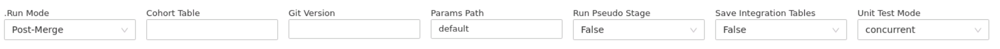
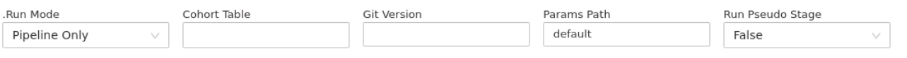

# Running the pipeline

This KOP details information about running the CVD Prevent Tool Pipeline.

The pipeline can be run as:

  * Part of the **Post-merge** process from the [**main**](../main.py) notebook
  * As an isolated pipeline run using the **Pipeline only** run mode in the [**main**](../main.py) notebook
  * Using the specific run_pipeline notebook in [**main_notebooks/**](../main_notebooks)

## Page Navigation
- [Quick Start: Running the Pipeline](#quick-start-running-the-pipeline)
- [Running from the main notebook](#running-from-the-main-notebook)
  - [Configuring the Notebook](#configuring-the-notebook)
  - [Widget Definitions](#widget-definitions)
- [Running from the run_pipeline notebook](#running-from-the-run_pipeline_notebook)

# Quick Start: Running the Pipeline
The full pipeline is run from main from the master branch. The following are the steps for running the default pipeline.

1. Ensure that the main notebook widgets are setup (standard configuration only is listed below):

    | **Widget** | **Value** |
    | --- | --- |
    |**.Run Mode** |	Post-Merge **or** Pipeline Only |
    | **Cohort Table** |	null |
    | **Git Version** |	Latest commit hash from GitLab |
    | **Params Path** |	'default' |
    | **Run Pseudo Stage** |	False |

2. Post in the MS Teams channel with this message:
    | @Data science Starting a full pipeline run at HH:MM. Reminder that branches can be created but not merged during the pipeline run. | 
    |---|

3. Attach the main notebook to the **covid19_idsm_cluster_1**
4. Clear the state and cell outputs of the notebook
5. Follow the in-notebook instructions for the running steps, ensuring that the widgets have been configured as above (or user specified)
6. Once the main notebook has completed running, reply to the original MS Teams channel message with **Done**

##### Running the Pipeline
Branches can be created but cannot be merged during the running of the pipeline. 
##### Notebook State

You can clean the state of the notebook via the menu Clear > Clear State 
##### Notebook Jobs

When using the main notebook you can view outputs, errors etc by clicking on the #Notebook XXXXX links generated as the main  run executes the various notebook(s).
##### Notebooks for running the pipeline

The quick start only covers the usual pipeline running method, via the main notebook. See further down for details on additional main configuration and alternative pipeline running via the [run_pipeline](../main_notebooks/run_pipeline.py) notebook.

# Running from the main notebook
## Configuring the Notebook

The main notebook is used for the majority of codebase running in the CVD Prevent Tool, and can be run in different modes, defined by the **.Run Mode** widget.

A full pipeline run is completed as part of the **Post-Merge** and **Pipeline Only** run modes. The pipeline is run in full in both modes, with the only differences being:

  * **Post-Merge:** This runs the unit tests, integration tests and then a full pipeline run
  * **Pipeline Only:** This executes a full pipeline run **only** (no unit or integration tests)
After selecting one of these run modes, the notebook (and subsequent pipeline run) can then be configured by additional widgets. Whilst each mode has slightly different configurable widgets, the ones for controlling the pipeline are present in both. Screenshots of the widgets are given below:

**Screenshot |** Configurable widgets for the Post-Merge run mode

**Screenshot |** Configurable widgets for the Pipeline Only run mode

These widget configurations should be checked and adjusted (if required) prior to running the remainder of the main notebook.

##### Pipeline Widgets

By default, most of the widgets will be populated for a standard pipeline run, except for Git Version. This must be specified prior to any pipeline run (default value is null which will result in an error).

## Widget Definitions

The widgets used in the **Post-Merge** and **Pipeline only** run modes can be configured as follows (below).

These widgets map values from [main](../main.py) notebook to the [run_pipeline](../main_notebooks/run_pipeline.py) notebook, the notebook that is executed to run the full pipeline. 

##### Widget mapping from main to run_pipeline

The widgets used in the main  notebook are named slightly different to those in [run_pipeline](../main_notebooks/run_pipeline.py), for usability reasons. The corresponding widget name is defined below the main notebook widget definition.

### Cohort Table
**Mapping widget value: cohort_table**

This widget indicates whether to use a previous eligible patient cohort table. This widget is a dropdown-combobox, so you can either **(A)** select options or **(B)** enter free text.

Setting up the widget:

  1. **Create a new cohort table.** By default this widget will be a blank string.
  2. **Use the latest cohort table.** The only dropdown option is for the most recent (on date) cohort table. 
  3. **Specify custom cohort table.** Free text can be entered to specify the name of a custom cohort table.

##### Database and table

The cohort table must be in the **prevent_tool_collab** database to be used.

### Git Version
**Mapping widget value: git_version**

This is copied directly from the latest commit hash of the master branch on GitLab.

Setting up the widget:

  * On the master branch on GitLab, go to Repository → Commits 
  * On the right side, click **Copy commit SHA** for the latest commit.

##### Blank git version

Always ensure that you have copied across the latest git hash of the **master** branch from GitLab before running the pipeline. If the pipeline run is a "test" run (e.g. not run from the master branch) then please use a git_version of **dev_NN** where **NN** are your initials.
##### Pipeline Run Error: Git Version

The pipeline will not run if the **git_version** widget is blank

### Params Path
**Mapping widget value: params_path**

This specifies the params that you are using to run the pipeline.

Unless you are running a custom config, then this should be **default.**

Setting up the widget:

  * Enter value default into the widget
OR
  * Enter the name of the custom params notebook

##### Default Parameters

For most pipeline runs, the 'default' params notebook should be used.

### Run Pseudo Stage
**Mapping widget value:** prepare_pseduo_assets 

This specifies if the [PseudoPreparationStage](../pipeline/pseudonymised_asset_preparation.py) stage of the pipeline should be executed.

This stage produces the cvdp_linkage_events_table and cvdp_linkage_patient_table assets, ready for pseudonymisation, that are used as part of external data sharing. 

Setting up the widget:

  * Select False (default) to skip the pseudonymisation preparation stage: the cvdp_linkage assets will not be generated
  * Select True to execute the pseudonymisation preparation stage: the cvdp_linkage assets will be generated

##### CVDP Linkage Table Names

The pipeline params variable PSEUDO_SAVE_OVERWRITE controls whether to overwrite **(True)** pre-existing CVDP Linkage tables or generate new ones **(False)**. When the overwrite is **True**, the CVDP Linkage tables will **not** contain the suffix of _date_version.

# Running from the run_pipeline notebook
The pipeline can also be run from the [**run_pipeline**](../main_notebooks/run_pipeline.py) notebook. The pipeline stages, as well as the order of running and passing of data and information, is defined in [**default_pipeline**](../pipeline/default_pipeline.py).

The main components of the **run_pipeline** notebook:

  1. **Widgets:** These control the running of the pipeline
  2. **Code cells:** The code cells are run to (A) setup the pipeline and (B) run the pipeline

The widgets are defined in the [same way as using the main notebook](#running-from-the-main-notebook) (please see the **Mapping widget values** for the run_pipeline equivalent). 

##### Running from run_pipeline

The same general process applies when running the pipeline from [run_pipeline](../main_notebooks/run_pipeline.py) as when running from [main](#quick-start-running-the-pipeline).

## FAQs

###### How do I know the pipeline run was successful?

A successful run of the pipeline will result in the generation of all tables, which will (in the table name) contain the date the pipeline was run (e.g. running the pipeline on 6th June 2022 the tables will contain ) These tables will be outputted in the prevent_tool_collab datavase of the DAE.  The tables will consist of:

- eligible cohort table
- preprocessed data tables (e.g.hes, mortality)
- events table
- patient table

###### How can I view output errors?

When using the run_pipeline notebook you can view outputs, errors etc by clicking on the #Notebook XXXXX link towards the bottom of the notebook page.
